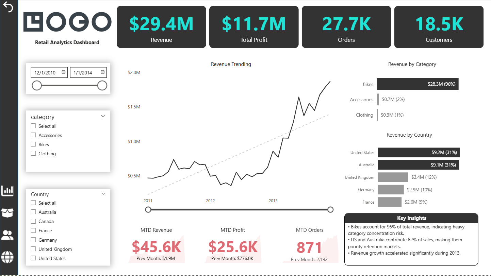
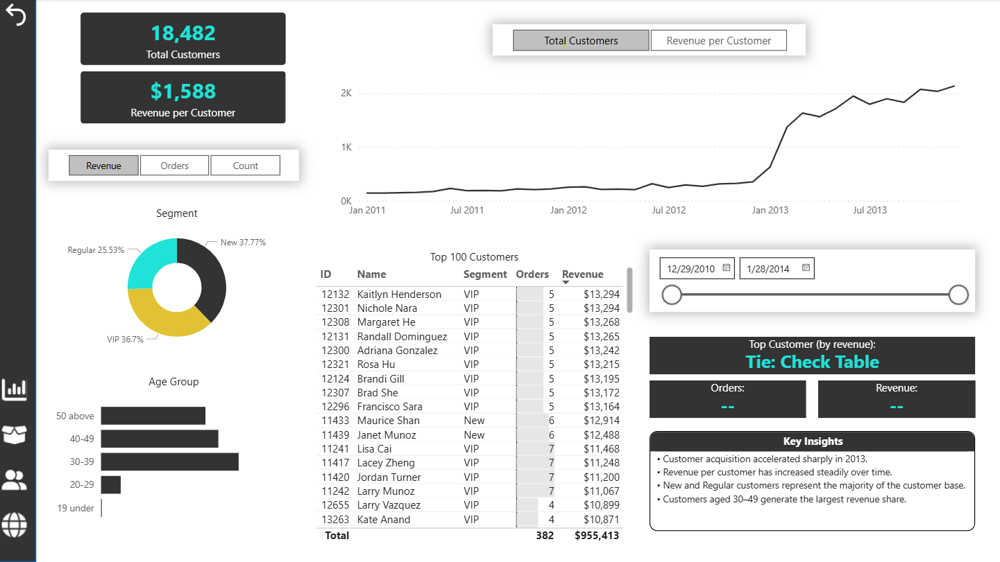
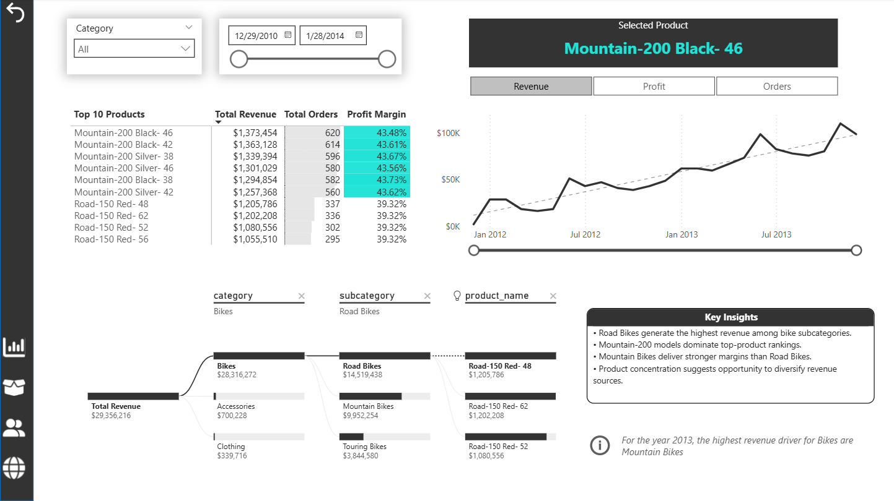
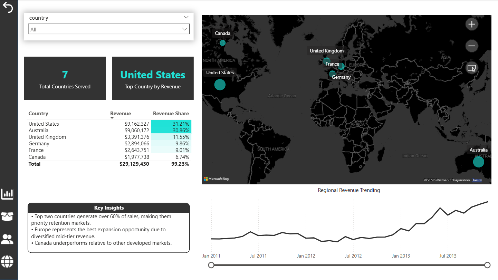
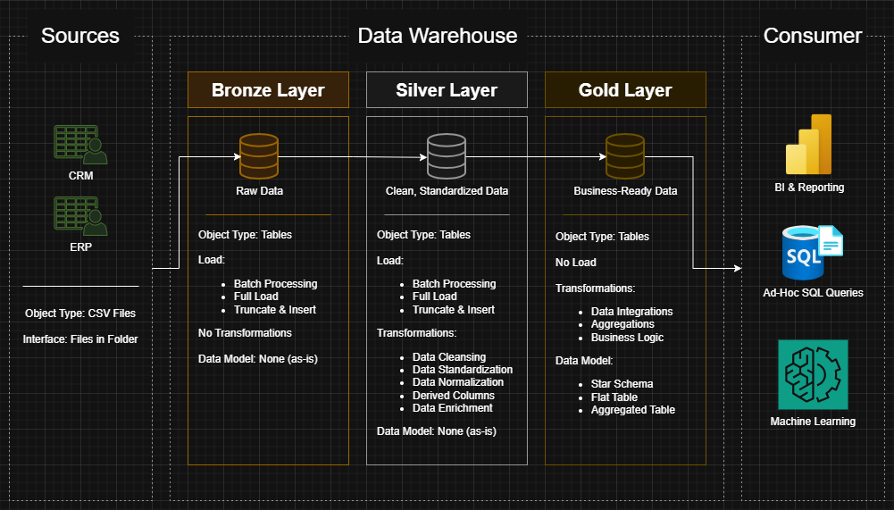
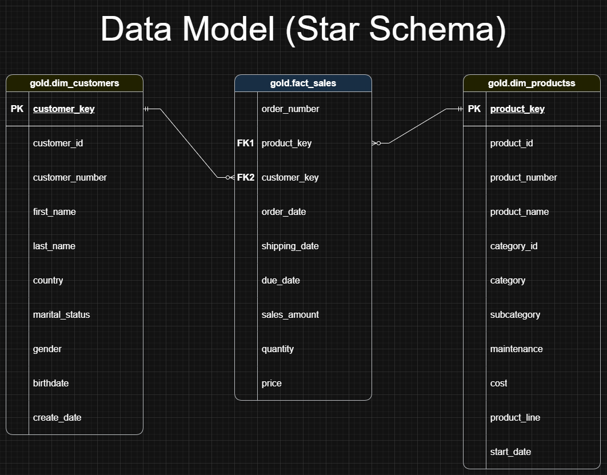
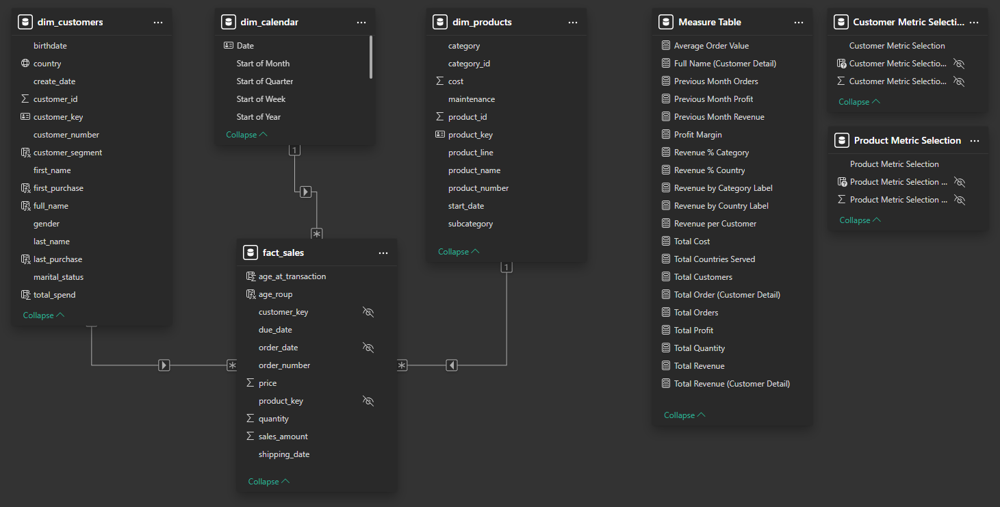
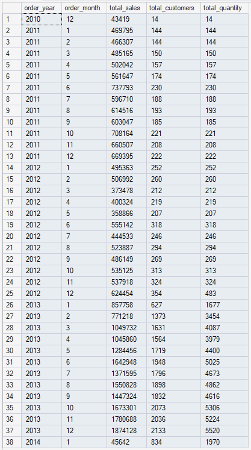
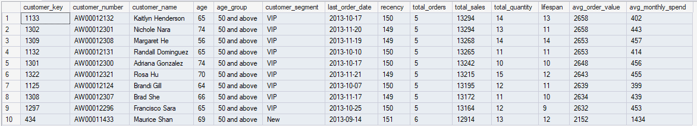
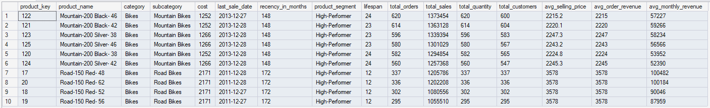

# Retail Data Warehouse & Analytics Project

End-to-end data analytics project that transforms raw retail CRM and ERP source data into a structured SQL data warehouse, performs business analysis using SQL, and delivers interactive dashboards in Power BI.

```text
Raw Source Files → Data Warehouse → SQL Analysis → Power BI Dashboard
```

---

## Project Snapshot

- **$29.4M** Revenue Analyzed
- **$11.7M** Total Profit
- **27.7K** Orders Processed
- **18.5K** Customers Analyzed
- **4** Interactive Dashboard Pages
- End-to-End Analytics Pipeline

---

## Dashboard Preview

### Executive Dashboard



### Customer Dashboard



### Product Dashboard



### Regional Dashboard



---

## Project Overview

The objective of this project was to simulate how a business can centralize fragmented CRM and ERP data into a modern analytics platform.

The project covers the full analytics lifecycle:

- Raw data ingestion from multiple source systems
- Layered warehouse transformation (Bronze / Silver / Gold)
- SQL-based business analysis
- Interactive dashboard reporting
- Documentation and reproducibility using GitHub

---

## Data Quality & Cleaning

The source CRM and ERP datasets were intentionally modified to simulate real-world dirty data scenarios.  

During the Silver Layer transformation process, the following cleaning steps were performed:

- Standardized coded values into descriptive business labels
- Selected the most recent valid record from duplicate histories
- Extracted substrings and enriched fields for usability
- Corrected invalid data types through casting and conversion
- Recalculated missing or incorrect values where possible
- Replaced or handled invalid values
- Managed null and missing records using business rules
- Standardized final column data types for downstream analytics

These steps ensured reliable, analytics-ready data for the Gold Layer and Power BI reporting.

---

## Business Questions Answered

- How is revenue trending over time?
- Which products generate the highest sales?
- Which product categories perform best?
- Which customers contribute the most revenue?
- Which regions or countries perform best?
- How can customers be segmented?

---

## Key Insights & Findings

### Revenue & Growth
- Revenue showed a strong upward trajectory, with accelerated growth during **2013**.
- The business generated **$29.4M revenue** and **$11.7M profit** during the reporting period.
- Growth momentum suggests stronger customer acquisition and repeat purchasing activity.

### Product Performance
- The **Bikes** category generated **96% of total revenue**, highlighting strong performance but also category concentration risk.
- **Road Bikes** outperformed Mountain Bikes as the top-performing subcategory by revenue.
- Multiple **Mountain-200** product variants ranked among the highest individual product performers.
- Mountain Bikes delivered stronger margins than Road Bikes, supporting profitability.

### Customer Insights
- **New** and **VIP** customers generated approximately **75% of total revenue**.
- Revenue per customer increased steadily over time.
- Customers aged **30–49** represented the highest-value customer segment.

### Regional Insights
- The **United States** and **Australia** generated over **60% of total revenue**, making them key priority markets.
- The **United Kingdom**, **Germany**, and **France** formed a strong secondary revenue tier.
- **Canada** underperformed relative to peer markets, indicating growth opportunity.

### Strategic Opportunities
- Reduce overreliance on Bikes by expanding Accessories and Clothing categories.
- Strengthen retention programs in top-performing countries.
- Increase focus on VIP customer loyalty and lifecycle campaigns.
- Target high-performing age segments (30–49) while building younger customer pipelines.

---

## Customer Segmentation Logic

### Spending Behavior

- **VIP** → Customers with at least 12 months of history and spending above $5,000
- **Regular** → Customers with at least 12 months of history and spending $5,000 or less
- **New** → Customers with less than 12 months of history

### Age Groups

- 19 and under
- 20–29
- 30–39
- 40–49
- 50 and above

This segmentation supports targeted marketing, retention, and product strategy.

---

## End-to-End Architecture

### Data Warehouse Architecture



### Warehouse Data Model



### Power BI Data Model



---

## SQL Analytics Highlights

### Revenue Over Time



### Top 10 Customers by Revenue



### Top 10 Products by Revenue



---

## Tech Stack

- SQL Server
- T-SQL
- SQL Server Management Studio (SSMS)
- Power BI
- Power Query
- DAX
- Git
- GitHub

---

## Skills Demonstrated

### Data Engineering
- ETL pipeline design
- Bronze / Silver / Gold architecture
- Data cleaning
- Data modeling
- Data integration

### SQL Analytics
- KPI creation
- Trend analysis
- Ranking analysis
- Cumulative analysis
- Segmentation
- Reporting queries

### Business Intelligence
- Power BI dashboard development
- Power Query transformations
- DAX measures
- Interactive reporting

### Professional Practices
- Git version control
- Repository documentation
- Structured project delivery

---

## Repository Structure

```text
retail-data-warehouse-analytics/
│── datasets/
│── sql/
│   ├── warehouse/
│   └── analytics/
│── powerbi/
│── docs/
│   ├── warehouse/
│   ├── analytics/
│   └── dashboard/
```

---

## Key Deliverables

- Structured retail data warehouse
- Analytical SQL scripts and query outputs
- Executive Power BI dashboards
- Documentation and architecture diagrams
- Reproducible end-to-end analytics project

---

## Contact

**Gaspar Juico**  
Open to Data Analyst opportunities involving SQL, Power BI, and business intelligence.

- LinkedIn: [Gaspar Juico](https://www.linkedin.com/in/gasparjuico/)
- GitHub: [gasparjuico](https://github.com/gasparjuico)